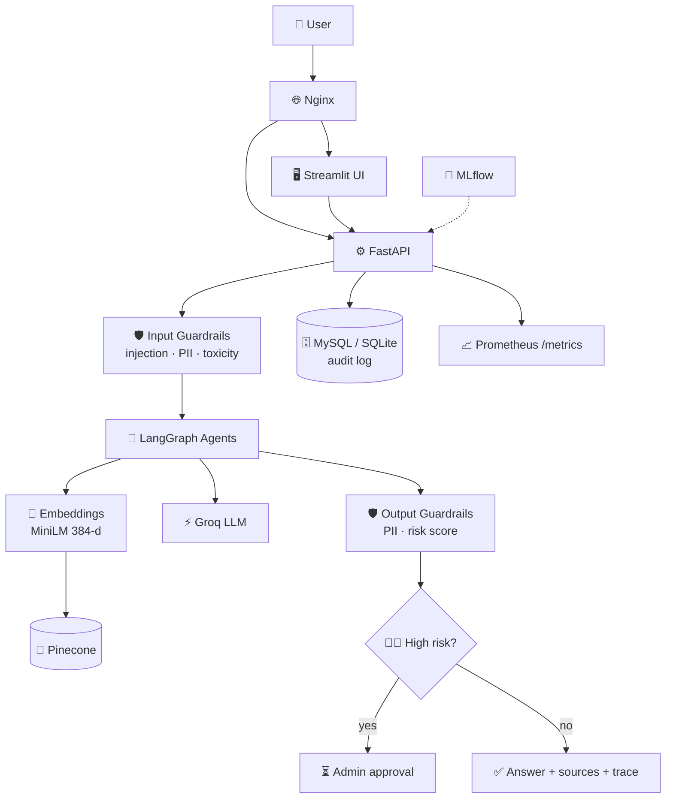
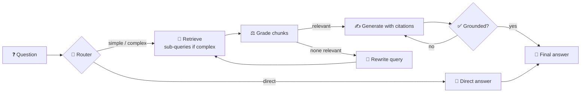
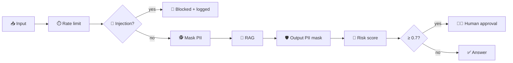

<div align="center">

# 🧠 Cortex: Enterprise AI Platform

### 🚀 Production-Grade **Agentic RAG** with Governance, Evaluation & MLOps


**📄 Upload documents → 🧹 Clean → ✂️ Chunk → 🔢 Embed → 🌲 Pinecone → 🤖 Agentic retrieval → ⚡ Groq LLM → ✅ Verify → 📊 Evaluate → 🔐 Govern → 🚢 Deploy**

</div>

---

## 📚 Table of Contents
1. [✨ Features](#-features)
2. [🏗️ Architecture](#️-architecture)
3. [🤖 Agent Workflow](#-agent-workflow)
4. [🧰 Tech Stack](#-tech-stack)
5. [📁 Project Structure](#-project-structure)
6. [⚡ Quick Start](#-quick-start)
7. [🔌 API Reference](#-api-reference)
8. [📊 Evaluation](#-evaluation)
9. [🔐 AI Governance & Security](#-ai-governance--security)
10. [🛠️ MLOps](#️-mlops)
11. [🐳 Docker, ☸️ Kubernetes & ☁️ AWS](#-docker-️-kubernetes--️-aws)
12. [🔄 CI/CD](#-cicd)
13. [🎓 Learning Modules](#-learning-modules)
14. [🧪 Tests](#-tests)
15. [🗺️ Roadmap](#️-roadmap)
16. [🛟 Troubleshooting](#-troubleshooting)
17. [🤝 Contributing](#-contributing)

---

## ✨ Features

| | Feature | Description |
|---|---|---|
| 📄 | **Document ingestion** | PDF, DOCX, TXT, MD loaders with text cleaning and paragraph-aware chunking |
| 🏷️ | **Metadata** | Source, page, chunk, department, timestamp stored with every vector |
| 🌲 | **Vector search** | Pinecone serverless (primary) + FAISS (local fallback) with metadata filtering |
| 🤖 | **Agentic RAG** | LangGraph state machine: router → retrieve → grade → rewrite → generate → verify |
| 🩹 | **Corrective RAG** | Retrieved chunks are graded; bad retrieval triggers query rewriting and a retry |
| 🪞 | **Self-RAG** | The answer is checked for groundedness and regenerated if unsupported |
| 🧭 | **Adaptive retrieval** | Simple questions use one search; complex ones are split into sub-queries; chit-chat skips retrieval |
| 🔐 | **Governance** | JWT, RBAC, rate limiting, prompt-injection & toxicity checks, PII masking, risk score |
| 🧑‍⚖️ | **Human approval** | High-risk answers are held until an admin approves or rejects them |
| 🧾 | **Audit log** | Every request stored with user, risk, latency, tokens, status (SQLite / MySQL) |
| 📊 | **Evaluation** | Recall@K, Precision@K, MRR, NDCG + LLM-judged faithfulness and relevance |
| 📈 | **Observability** | Prometheus `/metrics`, latency and token tracking, Streamlit dashboard |
| 🎓 | **Learning modules** | Backprop, normalization, attention, transformers, LoRA/QLoRA from scratch |
| 🚢 | **Deployment** | Docker Compose, Kubernetes manifests, GitHub Actions → ECR → EC2 |

---

## 🏗️ Architecture



---

## 🤖 Agent Workflow



| Node | Role | Pattern |
|---|---|---|
| 🧭 `router` | Classify question: direct / simple / complex | Adaptive retrieval |
| 🔎 `retrieve` | Vector search, splits complex questions | Multi-step retrieval |
| ⚖️ `grade` | Keep only relevant chunks | Corrective RAG |
| 🔁 `rewrite` | Improve the search query (max 2 retries) | Retrieval feedback loop |
| ✍️ `generate` | Cited answer from context only | RAG agent |
| ✅ `verify` | Groundedness check, one regeneration | Self-RAG |

---

## 🧰 Tech Stack

| Layer | Implementation |
|---|---|
| 🧠 LLM | Groq (`llama-3.3-70b-versatile`) via `core/llm.py` |
| 🌲 Vector DB | Pinecone serverless (`rag/vectorstore.py`); FAISS fallback with `VECTOR_BACKEND=faiss` |
| 🔢 Embeddings | `all-MiniLM-L6-v2` (384-d, local), since Groq has no embeddings API |
| 🕸️ Agents | LangGraph |
| ⚙️ API | FastAPI, JWT, RBAC, rate limiting, audit log, human approval |
| 🖥️ UI | Streamlit (chat, ingestion, dashboard, approvals, evaluation) |
| 🗄️ Database | SQLite locally, MySQL in Docker |
| 🧪 MLOps | MLflow, scikit-learn pipeline |
| 🐳 Infra | Docker Compose, Kubernetes, Nginx |
| 🔄 CI/CD | GitHub Actions, Ruff, Pytest, Trivy |
| ☁️ Cloud | AWS EC2, ECR |

---

## 📁 Project Structure

```
cortex/
├── 🧠 core/              config + Groq LLM wrapper (token accounting)
├── ⚙️ backend/           FastAPI app (auth, ingest, query, audit, approvals, eval)
├── 🖥️ frontend/          Streamlit app
├── 🤖 agents/            LangGraph agentic / corrective / self-RAG graph
├── 📚 rag/               ingestion, embeddings, vector store, retrieval
├── 🔐 governance/        guardrails, JWT auth, audit log
├── 📊 evaluation/        retrieval metrics + LLM-judge runner
├── 📈 monitoring/        Prometheus metrics
├── 🧪 ml/                sklearn + MLflow pipeline
├── 🎓 deep_learning/     backprop, normalization, transformer, LoRA fine-tuning
├── ✅ tests/             pytest unit tests
├── 🐳 docker/            Dockerfiles + nginx.conf
├── ☸️ kubernetes/        platform.yaml
├── 🔄 .github/workflows/ ci-cd.yml
├── 📮 Cortex.postman_collection.json
├── 🐙 docker-compose.yml
└── 📄 README.md
```

---

## ⚡ Quick Start

### 1️⃣ Install
```bash
python -m venv .venv && source .venv/bin/activate
pip install -r requirements.txt -r requirements-frontend.txt
cp .env.example .env
```

### 2️⃣ Add your keys in `.env` 🔑
```env
GROQ_API_KEY=your_groq_api_key
PINECONE_API_KEY=your_pinecone_api_key
JWT_SECRET=a-long-random-string
```
> 💡 No Pinecone key yet? Set `VECTOR_BACKEND=faiss` (in-memory, resets on restart).

### 3️⃣ Run
```bash
uvicorn backend.main:app --reload     # 🖧 API  → http://localhost:8000/docs
streamlit run frontend/app.py         # 🖥️ UI   → http://localhost:8501
```

### 4️⃣ Log in 👤
| User | Password | Can do |
|---|---|---|
| `admin` | `admin123` | ingest documents, dashboard, approvals, evaluation, chat |
| `analyst` | `analyst123` | chat only |

> ⚠️ **Change these passwords and `JWT_SECRET` in `.env` before any real deployment.**

---

## 🔌 API Reference

Base URL: `http://localhost:8000` (🐳 Docker Compose: `http://localhost/api`) · 📖 Swagger: `/docs` · 📮 Import `Cortex.postman_collection.json`

| Method | Endpoint | Access | Body |
|---|---|---|---|
| `POST` | `/auth/token` | 🌍 public | form-urlencoded: `username`, `password` |
| `POST` | `/ingest` | 👑 admin | form-data: `file`, `department` |
| `POST` | `/query` | 👤 any user | JSON |
| `GET` | `/audit?limit=50` | 👑 admin | none |
| `GET` | `/approvals` | 👑 admin | none |
| `POST` | `/approvals/{id}/approve` or `/reject` | 👑 admin | none |
| `POST` | `/eval?k=5` | 👑 admin | JSON list |
| `GET` | `/health` | 🌍 public | none |
| `GET` | `/metrics` | 🌍 public | none |

**📨 Query example**
```json
{ "question": "What is the leave policy?", "top_k": 5, "department": null }
```

**📬 Response**
```json
{
  "id": 12, "answer": "Employees get 24 days of leave [1].", "status": "ok",
  "risk": 0.0, "route": "simple", "grounded": true,
  "sources": [{ "source": "handbook.pdf", "page": 4, "score": 0.81, "snippet": "..." }],
  "trace": ["router -> simple", "retrieve 1 query(ies) -> 5 chunks", "grade: 3/5 relevant", "generate", "verify: grounded=True"],
  "latency_ms": 1820, "tokens": 1432
}
```

---

## 📊 Evaluation

| Category | Metrics |
|---|---|
| 🔎 Retrieval | Recall@K, Precision@K, MRR, NDCG@K |
| ✍️ Generation | Faithfulness, answer relevance, context relevance (LLM-judge), hallucination rate |
| ⚙️ System | Latency, token usage, error rate (audit log + dashboard) |

Run from the **🧪 Evaluation** tab in Streamlit, the `/eval` endpoint, or the CLI:
```bash
python -m evaluation.runner my_dataset.json
```
```json
[{ "question": "What is the leave policy?", "relevant_sources": ["handbook.pdf"] }]
```

---

## 🔐 AI Governance & Security



| Control | Status |
|---|---|
| 🔑 JWT authentication | ✅ |
| 👥 Role-based access (admin / analyst) | ✅ |
| ⏱️ Rate limiting (per user) | ✅ |
| 💉 Prompt-injection / jailbreak detection | ✅ pattern-based |
| 🕵️ PII detection and masking | ✅ email, phone, SSN, card |
| 🤬 Toxicity detection | ✅ keyword-based |
| 🎯 Risk scoring | ✅ |
| 🧑‍⚖️ Human approval for high-risk answers | ✅ |
| 🧾 Audit logging | ✅ |

> 🧱 Detectors are rule-based, which is a solid baseline but not complete protection. For production, add an ML classifier (for example Llama Guard) on top.

---

## 🛠️ MLOps

```
Data → Experiment → Training → Evaluation → Tracking (MLflow) → Deployment → Monitoring
```
```bash
python -m ml.pipeline      # validate → features → select → train → evaluate → log to MLflow
```
MLflow UI is available at `http://localhost:5000` with Docker Compose.

---

## 🐳 Docker, ☸️ Kubernetes & ☁️ AWS

### 🐳 Docker Compose
```bash
docker compose up -d --build     # 🌐 UI http://localhost · 🔌 API /api · 🧪 MLflow :5000
```
Services: `nginx`, `frontend`, `backend`, `mysql`, `mlflow`.

### ☸️ Kubernetes
```bash
kubectl apply -f kubernetes/platform.yaml     # replace ECR_REGISTRY and secrets first
```
Includes Namespace, ConfigMap, Secret, PVC, Deployments, Services, Ingress, readiness/liveness probes and a Horizontal Pod Autoscaler.

### ☁️ AWS EC2
```bash
bash ec2_setup.sh        # on a fresh Ubuntu EC2 (t3.large+, open ports 22 and 80)
# then edit .env and run: docker compose up -d --build
```
Create ECR repos: `cortex-backend`, `cortex-frontend`.

---

## 🔄 CI/CD

```
Push → Ruff lint → Pytest → Docker build → Trivy scan → Push to ECR → Deploy to EC2
```
🔑 GitHub secrets: `AWS_ROLE_ARN`, `EC2_HOST`, `EC2_SSH_KEY`

---

## 🎓 Learning Modules

```bash
pip install -r requirements-dl.txt
python -m deep_learning.backprop        # 🧮 manual backprop, verified vs PyTorch autograd
python -m deep_learning.normalization   # 📏 BatchNorm / LayerNorm from scratch
python -m deep_learning.transformer     # 🔭 attention, MHA, positional encoding, tiny GPT
python -m deep_learning.lora_finetune --model Qwen/Qwen2.5-0.5B --samples 500   # 🔧 LoRA
python -m deep_learning.lora_finetune --qlora                                   # 🧊 QLoRA (CUDA)
```

---

## 🧪 Tests
```bash
pytest -q tests      # 🛡️ guardrails · ✂️ chunking · 📊 metrics · ⏱️ rate limiter
ruff check .         # 🧹 lint
```

---

## 🗺️ Roadmap

- [x] 📄 Ingestion, chunking, Pinecone retrieval
- [x] 🤖 Agentic, Corrective and Self-RAG graph
- [x] 🔐 JWT, RBAC, guardrails, audit, human approval
- [x] 📊 Evaluation metrics and dashboard
- [x] 🐳 Docker Compose · ☸️ Kubernetes · 🔄 CI/CD · ☁️ EC2
- [ ] 🕸️ Graph RAG (entities → knowledge graph)
- [ ] 🧩 Multi-vector retrieval (summaries, tables, images)
- [ ] 🗃️ SQL / Data agent and query routing across stores
- [ ] 🔀 Reranking
- [ ] ⚡ FSDP / DeepSpeed distributed training configs
- [ ] 📦 DVC data versioning
- [ ] 📉 Drift detection and Grafana dashboards

---

## 🛟 Troubleshooting

| Problem | Fix |
|---|---|
| 🔑 `GROQ_API_KEY is not set` | Add the key to `.env` and restart the API |
| 🌲 `PINECONE_API_KEY is not set` | Add the key, or set `VECTOR_BACKEND=faiss` |
| 🚫 `401` | Token missing or expired (1 hour), log in again |
| 🔒 `403` | You are logged in as `analyst`; use `admin` |
| 💉 `400 possible prompt injection` | The guardrail blocked the question |
| 📝 `422` on login | Send form-urlencoded, not JSON |
| 🐢 Slow first request | The embedding model downloads on first use |

---

## 🤝 Contributing
1. 🍴 Fork the repo
2. 🌿 Create a branch: `git checkout -b feature/my-feature`
3. ✅ Run `ruff check .` and `pytest -q tests`
4. 📬 Open a Pull Request

<div align="center">

### ⭐ If you find Cortex useful, give it a star! ⭐

**Built with ❤️ using LangGraph · Pinecone · Groq · FastAPI · Streamlit**

</div>
